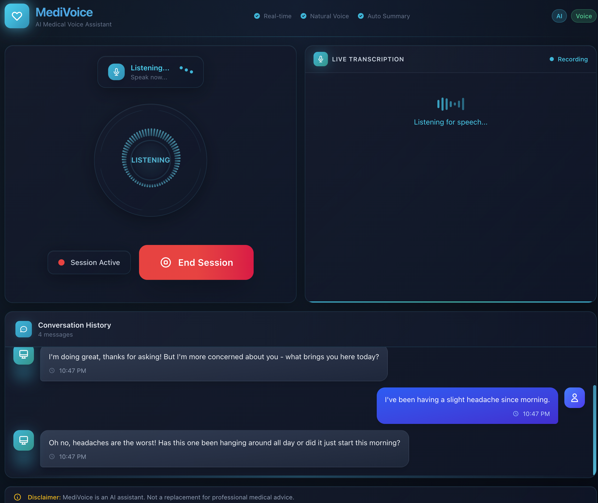
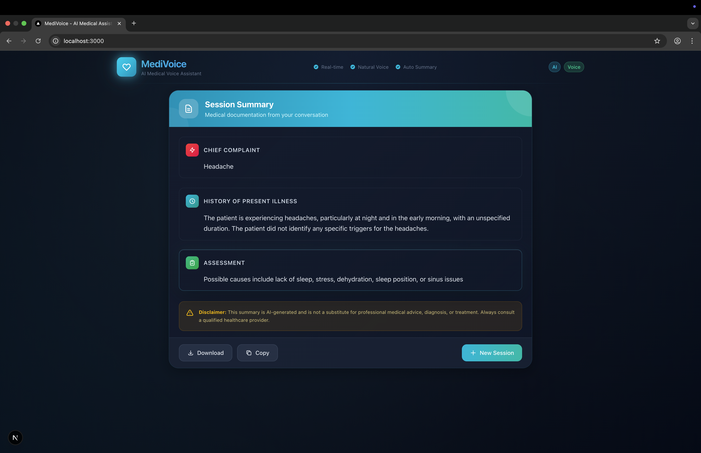

<p align="center">
  
</p>

<h1 align="center">MediVoice</h1>

<p align="center">
  <strong>Real-time AI-Powered Voice Medical Assistant</strong>
</p>

<p align="center">
  <a href="#features">Features</a> •
  <a href="#demo">Demo</a> •
  <a href="#architecture">Architecture</a> •
  <a href="#installation">Installation</a> •
  <a href="#usage">Usage</a> •
  <a href="#api">API</a> •
  <a href="#tech-stack">Tech Stack</a>
</p>

<p align="center">
  
  
  
  
  
  
</p>

<p align="center">
  
  
  
  
</p>

---

## Overview

**MediVoice** is a cutting-edge, real-time voice-based AI medical assistant that enables natural conversations about health concerns. It combines state-of-the-art speech recognition, large language models, and text-to-speech technology to create a seamless, hands-free medical consultation experience.

The application features intelligent Voice Activity Detection (VAD) that naturally handles conversational pauses, allowing users to speak at their own pace without artificial interruptions.

---

## Demo

### Home Screen
*Real-time voice interaction with visual feedback and live transcription*

<p align="center">
  
</p>

### Medical Summary
*Automatic generation of structured medical summaries after each session*

<p align="center">
  
</p>

---

## Features

### Core Capabilities

- **Real-time Voice Conversations** - Speak naturally with the AI assistant using your microphone
- **Intelligent VAD (Voice Activity Detection)** - Silero-based VAD with 3-second pause tolerance for natural speech patterns
- **Live Transcription** - See your words transcribed in real-time as you speak
- **Natural Voice Responses** - High-quality ElevenLabs TTS for lifelike assistant responses
- **Medical Context Awareness** - AI trained to understand and respond to health-related queries
- **Automatic Session Summaries** - Get structured medical summaries including:
  - Chief complaints
  - Symptoms analysis
  - Possible conditions
  - Recommended next steps

### User Experience

- **Glass-morphism UI** - Modern, elegant dark theme with glassmorphic design
- **Circular Voice Visualizer** - Dynamic audio visualization with 64-bar radial display
- **Side-by-side Layout** - Voice interaction on left, live transcription on right
- **Responsive Design** - Optimized for desktop and tablet screens
- **Real-time Status Indicators** - Visual feedback for listening, thinking, and speaking states

---

## Architecture

```
┌─────────────────────────────────────────────────────────────────┐
│                         Frontend (Next.js)                      │
│  ┌─────────────┐  ┌──────────────┐  ┌────────────────────────┐  │
│  │   Silero    │  │    React     │  │   Audio Playback       │  │
│  │    VAD      │──│  Components  │──│   (Web Audio API)      │  │
│  │  (ONNX)     │  │              │  │                        │  │
│  └──────┬──────┘  └──────────────┘  └────────────────────────┘  │
│         │                                                       │
│         │ PCM Audio (Int16)                                     │
│         ▼                                                       │
│  ┌─────────────────────────────────────────────────────────────┐│
│  │                    WebSocket Connection                      │
│  └─────────────────────────────────────────────────────────────┘│
└─────────────────────────────────────────────────────────────────┘
                              │
                              ▼
┌─────────────────────────────────────────────────────────────────┐
│                       Backend (FastAPI)                         │
│  ┌─────────────────────────────────────────────────────────────┐│
│  │                    WebSocket Handler                         │
│  └──────┬──────────────────┬──────────────────────┬────────────┘│
│         │                  │                      │             │
│         ▼                  ▼                      ▼             │
│  ┌─────────────┐   ┌─────────────┐        ┌─────────────┐       │
│  │  Deepgram   │   │    Groq     │        │  ElevenLabs │       │
│  │   (STT)     │   │   (LLM)     │        │   (TTS)     │       │
│  │             │   │             │        │             │       │
│  │ Real-time   │   │ Llama 3.3   │        │ Voice       │       │
│  │ Streaming   │   │   70B       │        │ Synthesis   │       │
│  └─────────────┘   └─────────────┘        └─────────────┘       │
│         │                  │                      │             │
│         ▼                  ▼                      ▼             │
│  ┌─────────────────────────────────────────────────────────────┐│
│  │                   Session Manager                            │
│  │          (Conversation History & State)                      │
│  └─────────────────────────────────────────────────────────────┘│
└─────────────────────────────────────────────────────────────────┘
```

### Data Flow

1. **Voice Input** → Silero VAD detects speech and captures audio
2. **Audio Streaming** → PCM audio sent via WebSocket to backend
3. **Transcription** → Deepgram converts speech to text in real-time
4. **AI Processing** → Groq LLM generates contextual medical response
5. **Voice Output** → ElevenLabs synthesizes natural speech
6. **Audio Playback** → Frontend plays response through Web Audio API

---

## Installation

### Prerequisites

- **Node.js** 18+ and **pnpm**
- **Python** 3.12+
- API keys for:
  - [Deepgram](https://deepgram.com/) (Speech-to-Text)
  - [Groq](https://groq.com/) (LLM)
  - [ElevenLabs](https://elevenlabs.io/) (Text-to-Speech)

### Backend Setup

```bash
# Navigate to backend directory
cd backend

# Create virtual environment
python -m venv venv

# Activate virtual environment
source venv/bin/activate  # On Windows: venv\Scripts\activate

# Install dependencies
pip install -r requirements.txt

# Create environment file
cp .env.example .env
```

Configure your `.env` file:

```env
# API Keys
DEEPGRAM_API_KEY=your_deepgram_api_key
GROQ_API_KEY=your_groq_api_key
ELEVENLABS_API_KEY=your_elevenlabs_api_key

# Optional: ElevenLabs Voice ID
ELEVENLABS_VOICE_ID=your_preferred_voice_id

# Server Configuration
BACKEND_PORT=8000
FRONTEND_URL=http://localhost:3000
```

### Frontend Setup

```bash
# Navigate to frontend directory
cd frontend

# Install dependencies (VAD model files are copied automatically via postinstall)
pnpm install
```

> **Note:** The `pnpm install` command automatically copies required VAD and ONNX model files (~60MB) to the public directory.

---

## Usage

### Starting the Application

**Terminal 1 - Backend:**
```bash
cd backend
source venv/bin/activate
uvicorn main:app --host 0.0.0.0 --port 8000
```

**Terminal 2 - Frontend:**
```bash
cd frontend
pnpm dev
```

Open your browser and navigate to `http://localhost:3000`

### Having a Conversation

1. Click the **"Start Session"** button to begin
2. Allow microphone access when prompted
3. Speak naturally about your health concerns
4. The AI will respond with voice and text
5. Click **"End Session"** to receive a medical summary

---

## API

### WebSocket Endpoint

**URL:** `ws://localhost:8000/ws`

### Message Types

#### Client → Server

| Type | Format | Description |
|------|--------|-------------|
| Audio | Binary (Int16 PCM) | Raw audio data from microphone |
| `end_session` | `{"type": "end_session"}` | Request session end and summary |

#### Server → Client

| Type | Payload | Description |
|------|---------|-------------|
| `transcript` | `{text, is_final}` | Real-time transcription |
| `response` | `{text}` | AI assistant response text |
| `audio` | `{data, format}` | Base64 encoded MP3 audio |
| `status` | `{status}` | Current state (listening/thinking/speaking) |
| `summary` | `{data}` | Medical summary object |
| `error` | `{message}` | Error information |

### REST Endpoints

| Method | Endpoint | Description |
|--------|----------|-------------|
| GET | `/` | API information |
| GET | `/health` | Health check |

---

## Tech Stack

### Frontend

| Technology | Version | Purpose |
|------------|---------|---------|
| Next.js | 16.0 | React framework with App Router |
| React | 19.2 | UI component library |
| TypeScript | 5.x | Type-safe development |
| Tailwind CSS | 4.x | Utility-first styling |
| @ricky0123/vad-react | 0.0.36 | Voice Activity Detection |
| ONNX Runtime Web | 1.23 | Silero VAD model inference |

### Backend

| Technology | Version | Purpose |
|------------|---------|---------|
| FastAPI | 0.115+ | High-performance async API |
| Uvicorn | 0.27+ | ASGI server |
| Deepgram SDK | 3.0+ | Real-time speech-to-text |
| Groq SDK | 0.4+ | Ultra-fast LLM inference |
| ElevenLabs SDK | 1.0+ | Neural text-to-speech |
| Pydantic | 2.5+ | Data validation |

### AI Services

| Service | Model | Purpose |
|---------|-------|---------|
| Deepgram | Nova-2 | Real-time speech recognition |
| Groq | Llama 3.3 70B | Medical conversation AI |
| ElevenLabs | Multilingual v2 | Natural voice synthesis |

---

## Project Structure

```
MediVoice/
├── frontend/
│   ├── src/
│   │   ├── app/
│   │   │   ├── components/
│   │   │   │   ├── MediVoice.tsx        # Main application component
│   │   │   │   ├── VoiceVisualizer.tsx  # Circular audio visualizer
│   │   │   │   ├── LiveTranscript.tsx   # Real-time transcription
│   │   │   │   ├── ConversationPanel.tsx # Chat history
│   │   │   │   ├── SessionSummary.tsx   # Medical summary display
│   │   │   │   ├── ControlButtons.tsx   # Session controls
│   │   │   │   └── StatusIndicator.tsx  # Status display
│   │   │   ├── hooks/
│   │   │   │   ├── useVoiceAgent.ts     # Voice agent logic
│   │   │   │   └── useAudioPlayback.ts  # Audio playback
│   │   │   ├── globals.css              # Global styles
│   │   │   ├── layout.tsx               # App layout
│   │   │   └── page.tsx                 # Home page
│   │   └── lib/
│   │       ├── constants.ts             # App constants
│   │       └── utils.ts                 # Utilities
│   ├── scripts/
│   │   └── copy-vad-files.js            # Postinstall script for VAD files
│   └── package.json
│
├── backend/
│   ├── main.py                          # FastAPI application
│   ├── config.py                        # Configuration
│   ├── services/
│   │   ├── deepgram_service.py          # STT integration
│   │   ├── groq_service.py              # LLM integration
│   │   ├── elevenlabs_service.py        # TTS integration
│   │   └── session_manager.py           # Session state
│   ├── models/
│   │   ├── messages.py                  # WebSocket messages
│   │   └── medical.py                   # Medical data models
│   ├── utils/
│   │   └── audio.py                     # Audio utilities
│   ├── requirements.txt
│   └── .env
│
├── assets/
│   ├── logo.svg                         # MediVoice logo
│   ├── home.png                         # Home screen screenshot
│   └── summary.png                      # Summary screen screenshot
│
├── .gitignore                           # Git ignore rules
└── README.md
```

---

## Configuration

### VAD Settings

The Voice Activity Detection is tuned for natural medical conversations:

```typescript
{
  positiveSpeechThreshold: 0.6,   // Speech detection sensitivity
  negativeSpeechThreshold: 0.45,  // Silence tolerance
  redemptionMs: 3000,             // Wait 3s before ending speech
  preSpeechPadMs: 500,            // Include 500ms before speech
  minSpeechMs: 300                // Minimum speech duration
}
```

### Environment Variables

| Variable | Required | Description |
|----------|----------|-------------|
| `DEEPGRAM_API_KEY` | Yes | Deepgram API key for STT |
| `GROQ_API_KEY` | Yes | Groq API key for LLM |
| `ELEVENLABS_API_KEY` | Yes | ElevenLabs API key for TTS |
| `ELEVENLABS_VOICE_ID` | No | Custom voice ID |
| `BACKEND_PORT` | No | Backend port (default: 8000) |
| `FRONTEND_URL` | No | Frontend URL for CORS |

---

## License

This project is licensed under the MIT License.

---

<p align="center">
  <strong>Built with modern AI technologies for accessible healthcare</strong>
</p>

<p align="center">
  <sub>Powered by Deepgram, Groq, and ElevenLabs</sub>
</p>
